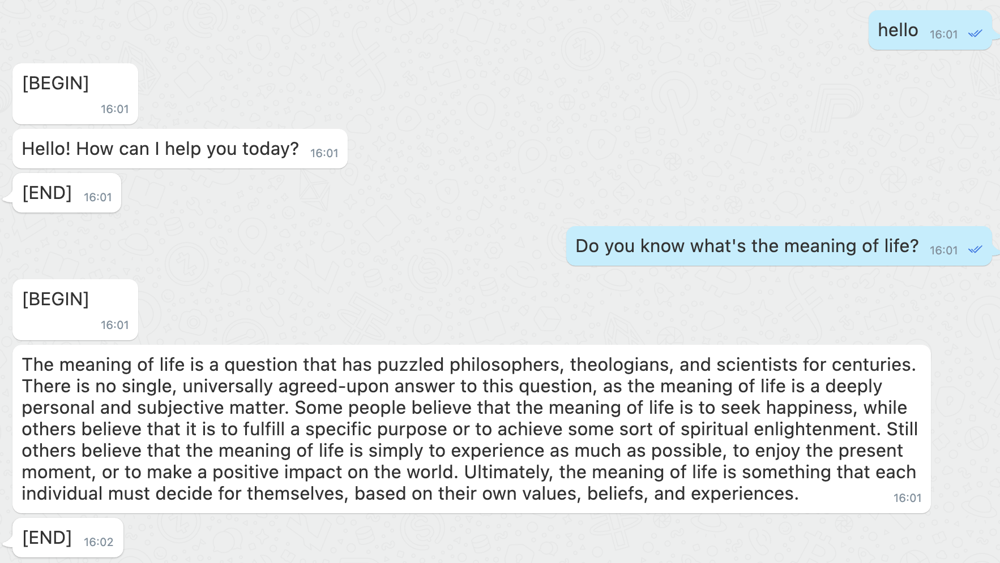

[](https://pypi.org/project/chatgpt-mixin)
[](https://pypi.org/project/chatgpt-mixin)

# chatgpt-mixin



Demo bot: 7000101691

# Installation

on unix like platform, install `chatgpt-mixin` with the following command:

```bash
python3 -m pip install -U chatgpt-mixin
playwright install firefox
```

on the Windows platform, use the following command to install `chatgpt-mixin`:

```bash
python -m pip install -U chatgpt-mixin
playwright install firefox
```

Install chatgpt-mixin with the support of login with browser:

```bash
python3 -m pip install -U chatgpt-mixin[browser]
```

# configuration

First, you need to create a mixin bot from [developers.mixin.one](https://developers.mixin.one/dashboard).
And then under the `Secret` tab, click `Ed25519 session` to generate an App Session configuration.

Second, you need at least have one chatgpt account, create it at [chat.openai.com](https://chat.openai.com/chat) if you don't have an account.

After that, you can start this bot with the following command:

```bash
python3 -m chatgpt_mixin bot-config.yaml
```

which bot-config.yaml contains mixin bot configuration and chatgpt accounts as shown below.

```yaml
bot_config:
  pin: ""
  client_id: ""
  session_id: ""
  pin_token: ""
  private_key: ""
openai_api_keys: []
accounts:
 - user: ""
   psw: ""
```

`bot_config` section specify mixin bot configure. `openai_api_keys` section specify openai api keys. `accounts` section specify chatgpt test accounts. `user` field can not be empty, but you can leave `psw` to empty. If it is left empty, the user will need to manually enter the password upon login. Multiple accounts can be specified in the accounts section to improve ChatGPT responses.

If you are running a bot in a server, you need to install `Xvfb` on the server, and use `VNC` at the client side to connect to `Xvfb`. For more information, refer to [Remote_control_over_SSH](https://en.wikipedia.org/wiki/Xvfb#Remote_control_over_SSH).


On the first time you start this bot, automated processes such as auto-filling of account names and passwords will be carried out, but you will still need to manually solve CAPTCHAs during the login process.

# Acknowledgements

- [chatgpt-api](https://github.com/transitive-bullshit/chatgpt-api)
- [chatGPT-telegram-bot](https://github.com/altryne/chatGPT-telegram-bot)
- [ChatGPT](https://github.com/ChatGPT-Hackers/ChatGPT)
